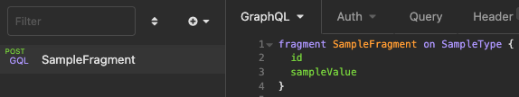
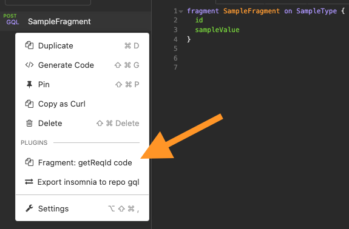
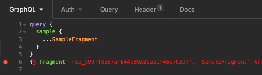

# insomnia-plugin-gql-fragments

An [Insomnia](https://insomnia.rest) Plugin Hack into Insomnia to support GQL Fragments.

## Installation

Install the `insomnia-plugin-gql-fragments` plugin from Preferences > Plugins.

## Usage
1. In a new graphql request, add your fragment

    

2. Inside the left sidebar, right-click on the request file, click on `Fragment: getReqId code` and copy the whole message content

    

3. Go to the graphl request where it's needed, and paste it at the end (ignore the syntax warning)

    

    Your request should now has access to the fragment!

## Known issues
- Comments inside fragment declarations are not properly parsed & cause errors when using them. A possible workaround is to add the comments after the declaration (after the last `}`).

## Contributing

Create a `.env` file in this repo with the following contents:
```
# Set to the location of the insomnia plugins folder (in Insomnia, go to
# Preferences -> Plugins, then click Reveal Plugins Folder)
# Default values are:
# MacOS: ~/Library/Application\ Support/Insomnia/plugins/
# Windows: %APPDATA%\Insomnia\plugins\
# Linux: $XDG_CONFIG_HOME/Insomnia/plugins/ or ~/.config/Insomnia/plugins/
PLUGINS_DIRECTORY=/mnt/c/Users/your_username/AppData/Roaming/insomnia/plugins
```

To install the plugin into Insomnia locally, run `install-plugin.sh`, then
refresh plugins in Insomnia or restart Insomnia.
